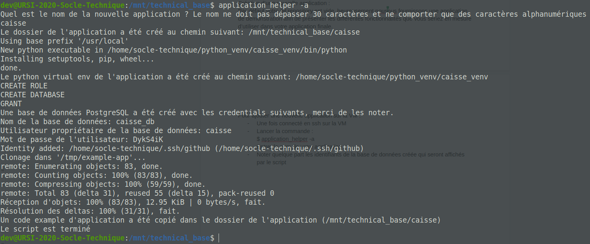

[home](../index.md)

# Create an Application

## Creating a new application:

By default your git repository is empty, fortunately we provide you with a demo application to present the different features you would be able to use in your final 
application.


## Create a new app on the VM:

Once VM ssh connection is established:
- Launch the command:
```bash
application_helper -a
```
- Enter the name of your application.
- Do not forget id of the created database that will be displayed by the script:


- The code of the application example has been cloned in your shared folder and is accessible from your host machine and therefore from your favorite IDE.
- Connect to the VM with SSH and go to the application folder (mnt/technical_base/appName). Then init your git repository and add the default remote :
```bash
git init
git remote add default 'votreAdresseGit'
```
- You can git push this white application on your repository.
```bash
git add *
git commit -m "Added structure of app"
git push origin master
```

## Pull an existing app on the VM:

If a member of your team has already created and pushed the base strucure of your app or if you want to test the integration of your application with those of other teams, you have to use the following command :
```bash
application_helper -p
```
- The script will ask you to enter the name of the application you want to pull
- As for the creation of application, the script will create a database with an associated user and also a python venv. Don't forget to note these logins informations.