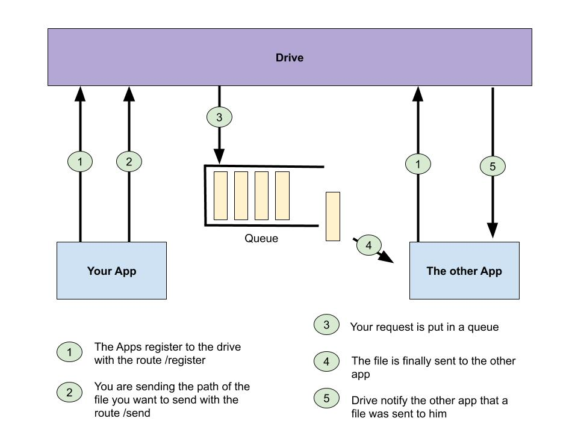

[Sommaire](https://ursi-2020.github.io/Documentation/)

# Asynchronous files manager (Drive)


## Usage

 Files are to big to be send inside HTTP request, so we created Drive.  
 Drive is a REST API you want to use for sending files.  
 
 
 
 
 ## Route 
 
 To sending information to drive you will use the package **requests**  
 requests is a package that allow you to do **get** and **post** HTTP request  
 Here is a guide of the library : https://realpython.com/python-requests/
 
 ### Register 

``` 
Route: '/register', methods=['POST']  
Requires a json body:  
{"app": "", "path": "", "route": ""}  
app : the name of your app  
path : the path where you want to recieve the files the others are sending to you  
route : the route wich Drive will call to tell you that a file was send to you. You need to create this route,  
as a POST method where we will send you a json body : {"app": "", "path": ""}  
with app : the name of the sender and path : the path of the file sent.
```

### Send

```
Route: '/send', methods=['POST']  
Requires a json body:  
{"me": "", "app": "", "path": "", "name_file": ""}
me : the name of your app  
app : the name of the app you are sending the file  
path : the path of the file you want to send
name_file : Optional but the name the file will get
```
 
