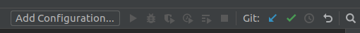
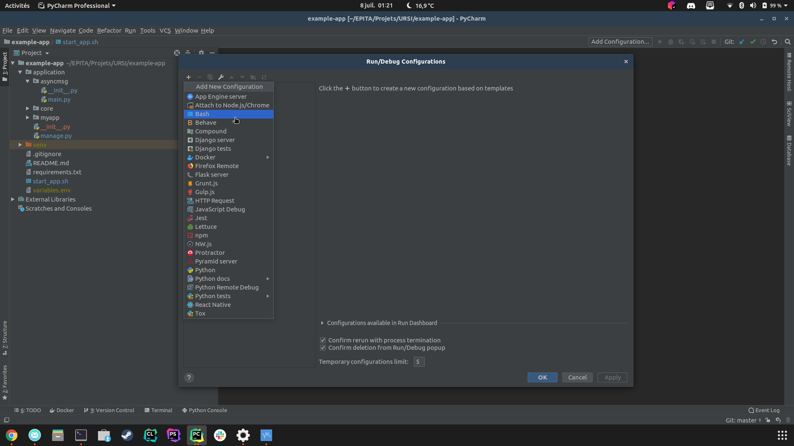
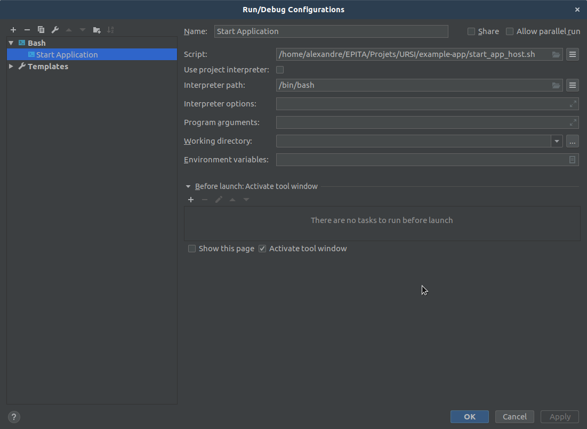
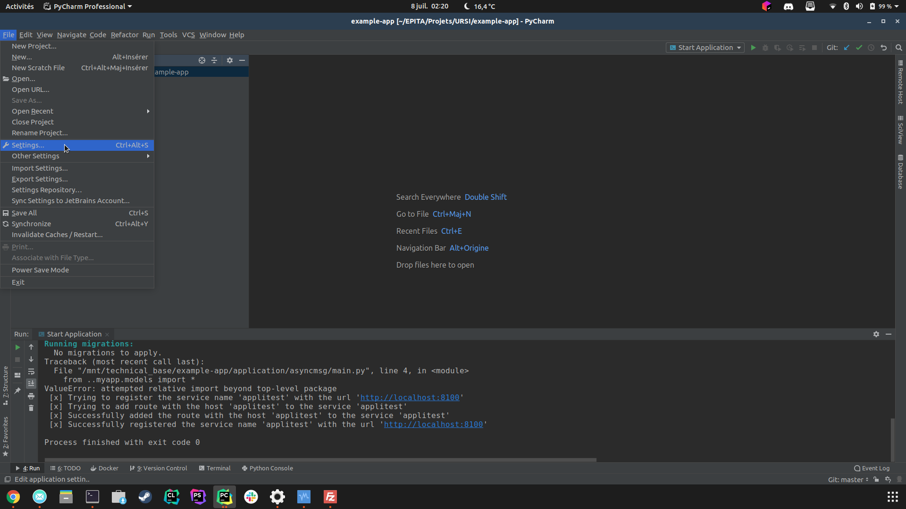
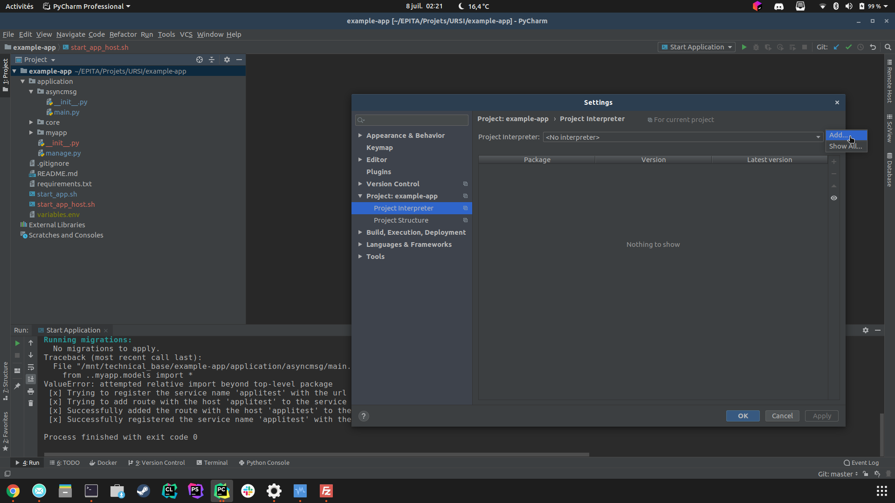
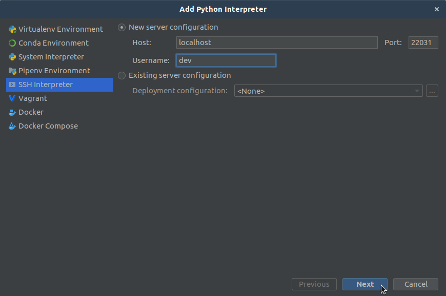
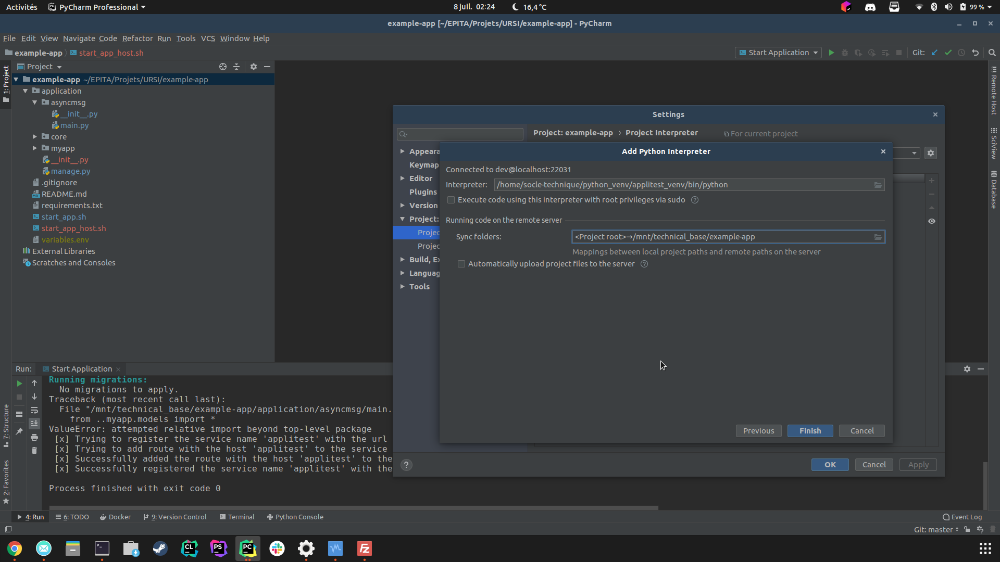
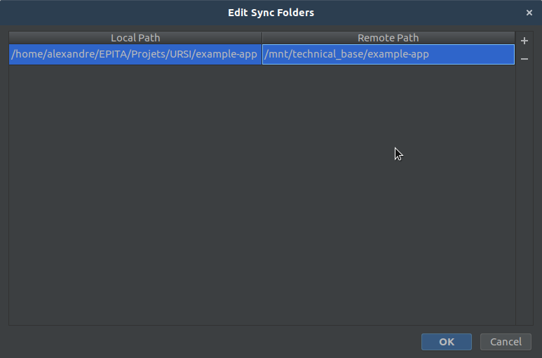
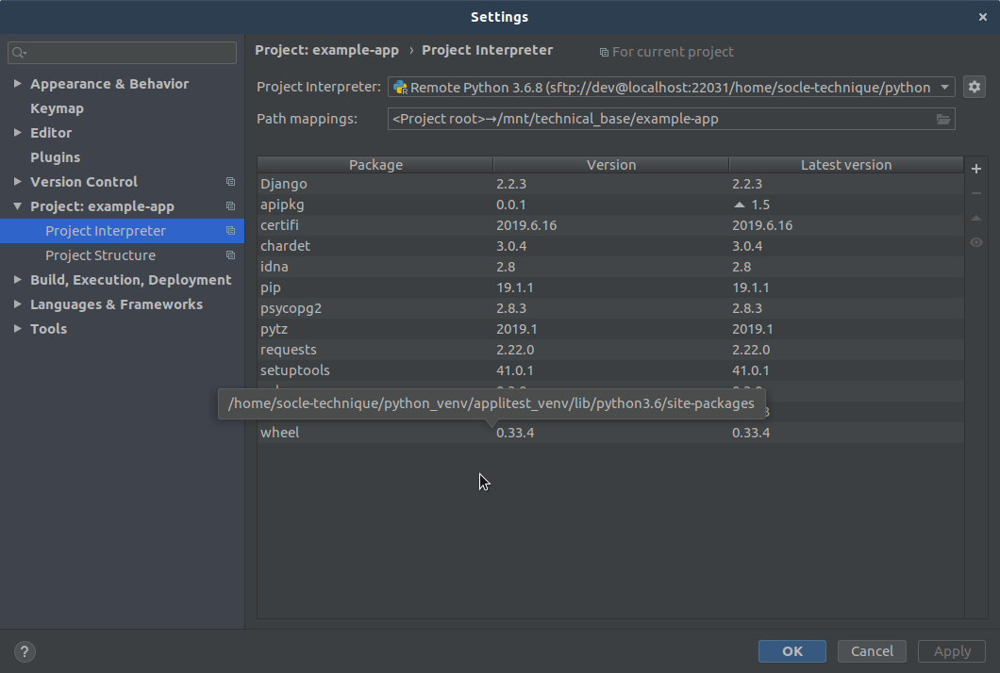

[home](../index.md)

# Start and debug your application

## Start your newly created application

Once the "application_helper" script has finished, a folder containing the application code was created in the shared folder.

To launch this application, it is necessary to run the "start_app.sh" script at the root of the application.
It will run two python process :
- One for the django server (myapp subfolder of the application)
- One for asynchronous communications (asyncmsg subfolder of the application)

This script must be run from the VM and not from the host machine !
You can either connect in ssh to the virtual machine to launch the script or create a shortcut on your Pycharm IDE.

Here are the steps to follow to configure this shortcut :

- To be able to run the "start_app.sh" script from your host computer, you must create an ssh pair of keys and add the public one on the VM.
This will not be explained in this tutorial, however you can check [this](https://adamdehaven.com/blog/how-to-generate-an-ssh-key-and-add-your-public-key-to-the-server-for-authentication/).
- Then, create a file named "start_app_host.sh" at the root of your application then fill it with this content :
```
#!/bin/bash
ssh dev@localhost -t -t -p 22031 /mnt/technical_base/example-app/start_app.sh
```
For sure, replace "example-app" in the path with the folder name of your application
- On the Pycharm shortcut bar, click on "Add Configuration"

- Click on the "+" then on "Bash"

- Fill in the following fields as shown in the image (remember to change the script path with the one of your application on your host computer). 

  If you are on Windows, change the "Interpreter path" field with the executable file path of Git Bash (usually ```C:\Program Files\Git\bin\sh.exe```) or you can use the default Windows shell (```C:\Windows\System32\cmd.exe```)

- Now you can run or stop your application through your favorite IDE :


## The variables.env file
When an application is created with the "application_helper" scrit a file called "variables.env" is created at the root of this application.
This file contains all the variables needed by the "start_app.sh" script. 

These variables correspond to the following :
- DJANGO_DB_USER : The name of the user with access to the application database
- DJANGO_DB_NAME : The name of the application database
- DJANGO_DB_PASSWORD : The user password of the application database
- DJANGO_APP_NAME : The name of the application, it is also the name by which the application will be registered in the API manager.
- WEBSERVER_PORT : The port on which the application's django server will run. Note that if you want to run multiple applications (to check communications between them for example), you have to set a different port for each application.

Do not push this file to your git ! Each member of your team has his own database with its own credentials.

## Debug your application
The problem is that your application is not running the same machine as your IDE. Don't worry (be happy), there is a solution : configuring a remote python interpreter. 

Here is how :
- Select File > Settings in Pycharm menu

- Go in Project > Project Interpreter section. Then click on the wheels icon then "Add."

- Select SSH Interpreter and put these settings then click "Next" :

- If you do not have setup an SSH key-based connection, it should ask you the password for the dev user.
- On the next screen, you have to enter the path of the python interpreter of the VM. Note that each application are assigned to a personal python virtual environment wich is created by the "application_helper" script.
  The path to the python executable to enter in this window is the following : ```/home/socle-technique/python_venv/**APP_NAME**_venv/bin/python``` 

- On the same window, make sure to uncheck "Automatically upload project files to the server", indeed our source files are in a shared folder.
- Then edit the path binding by clicking on the folder icon inside the "Sync folder field"
- Set the "Local Path" to the location of your application folder on your host machine, it should be already specified. 
  The "Remote Path" has this form : ```/home/technical_base/APP_FOLDER_NAME```

- Click "OK", then again "Finish", you should have your remote python interpreter setup, you can close the window if this is the case.


Remember of our start_app.sh ? Bad new : we can't combine remote python interpreter and this script in Pycharm.
So we have to create two debug run configuration (one for each process) inside our IDE :
- Upcoming