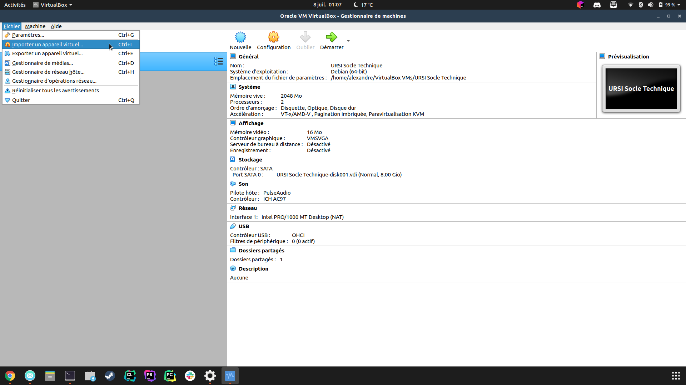
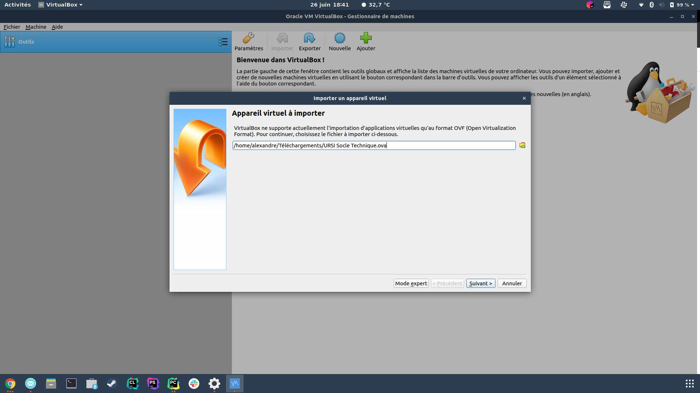
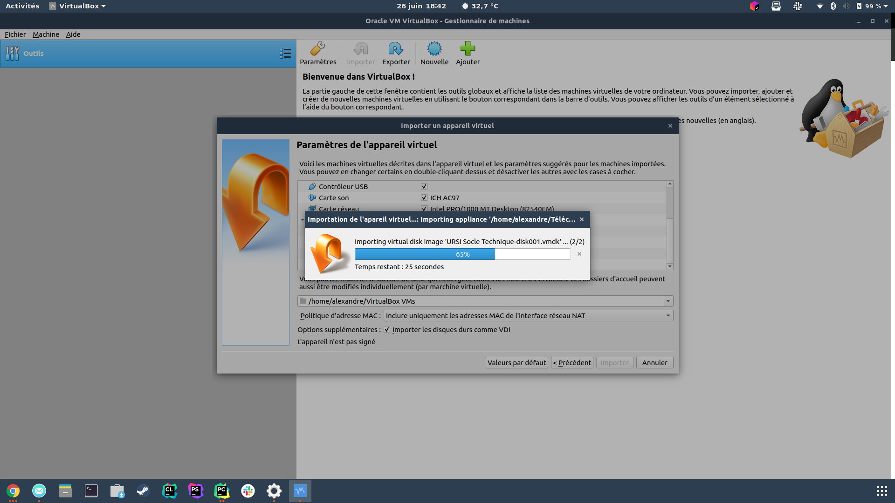
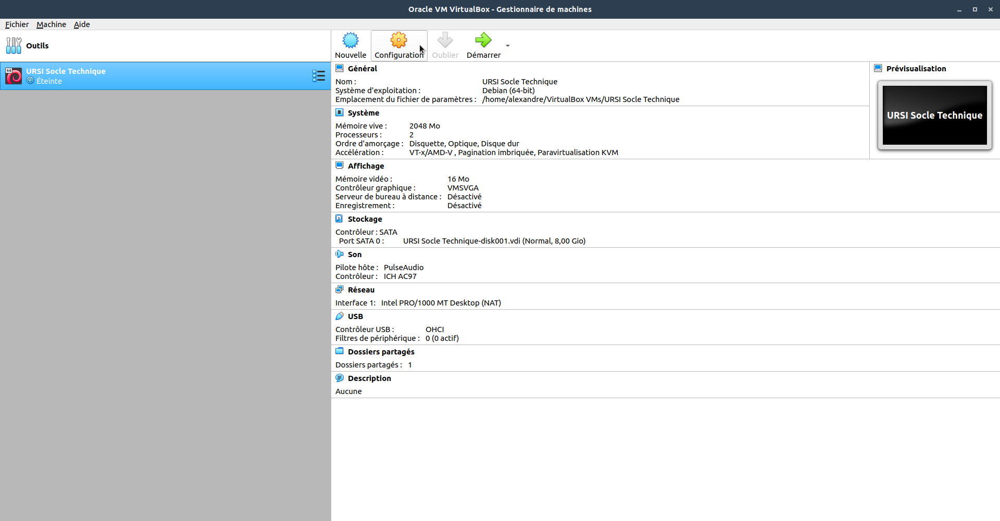
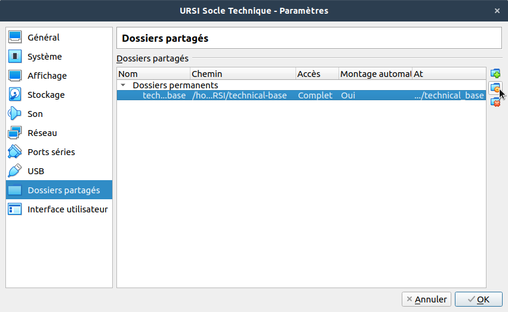
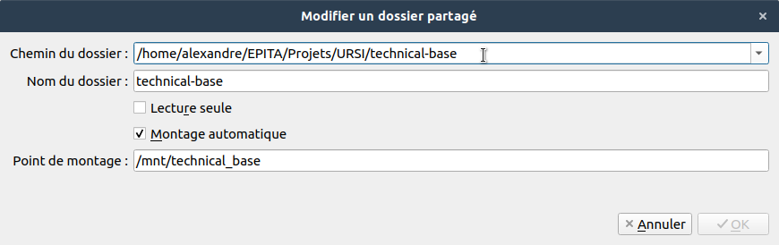
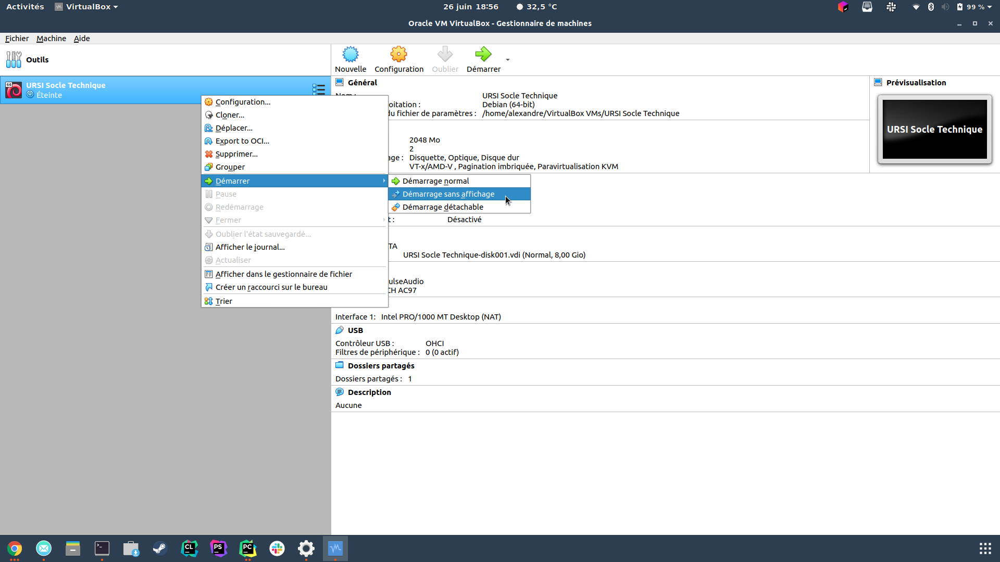

[home](../index.md)

# VM installation:

- Download the latest version of [VirtualBox](https://www.virtualbox.org/).
- Download the [image](https://tinyurl.com/yy7egysm/) of the VM.
- Launch VirtualBox.
- Import a new VM.

- Select the downloaded file.

- Import without changing any options.

- "Configuration > Shared Folder".


- Edit the shared folder so that it points to the previously cloned local git repository.

- Right click on the machine > start > start without display.


## SSH VM connection:

Open a terminal in the Host machine and write the following command in:
```
ssh dev@localhost -p 22031
```
Default password is "dev".
The shared folder is located at the following path: 
```
/mnt/technical_base/
```
## Basic error

### Windows :

If you can not launch the vm with virtual Box and you got (check the error cod you got on google):
```
Windows 10 Tech Preview
```
use this link and follow the tutorial :
```
https://appuals.com/fix-hypervisor-is-not-running-error-on-windows-10/
```

If you got this error :
```
Error 0x80070057
```

follow this tutorial :
```
https://appuals.com/windows-update-error-0x80070057-fix/
```
The method 2 works well.
